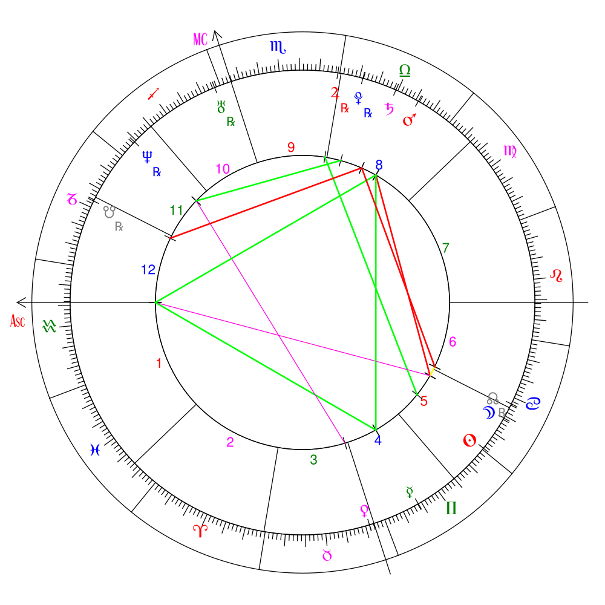

# Circular Natal Horoscope JS

By **horoscope**, we're talking about astrological **birth charts**. **Not  horoscope readings** or **interpretations**.

Example Chart:



The goal is to allow someone to:

1) Enter a calendar date + time and latitude/longitude coordinates for a position on the planet Earth.

2) And receive a javascript class that interfaces with a frontend library (maybe this one https://github.com/Kibo/AstroChart or a custom one) for creating the actual charts.

## Work in Progress

=> ~~Calculated SunSign from Tropical, Sidereal, and IAU Astronomical zodiacs~~

=> ~~the calculated major angles (`ascendant` and `Midheaven (MC)`) for a given datetime and origin~~

=> ~~the positions for all major bodies as they relate to the ecliptic for a given datetime and origin (`Sun`, `Moon`, `Mercury`, `Venus`, `Mars`, `Jupiter`, `Saturn`, `Uranus`, `Neptune`, `Pluto`)~~

=> ~~Positions of Lunar Nodes, Lilith~~

=> Positions of the lots (Fortune, Spirit, Eros, etc)

=> ~~Data for retrograde planets~~

=> ~~the cusps of each astrological sign as they relate to the 2D ecliptic chart for a given datetime, origin, and a particular house system.~~

=> ~~the cusps of each house within multiple house systems.~~ (Placidus, Koch, Topocentric, Regiomontanus, Whole Sign, and Equal House added.

=> ~~Data containing the sign major body, and house occupy~~.

=> ~~A list containing all the computed major and minor aspects of all bodies / points / angles.~~

=> ~~Capacity for language translations~~

## Future work

- I'm open to requests for house systems. I'm currently stopped at 6 - we have 2 "modern" systems (Topocentric, Koch), 2 "medieval" systems (Placidus, Regiomontanus), and 2 "ancient" systems (Whole Sign, Equal House). My formula resource "An Astrological House Formulary" by Michael P. Munkasey has many more house formulas I can implement if wanted. Hopefully I covered the most popular ones.


## Installation

If installing from source, clone this repo load the main file found at `dist/main.bundle.js`.

## Development

Install node modules

```
npm install

// or

yarn install
```

Then run

```

yarn start:dev
```

and any changes you make should be reflected in `dist/demo.html` if you open the file in a browser.

Run tests with

```
npm test

// or

yarn test
```

## Building

This package uses webpack to produce a javascript bundle. If modifying this code, a new bundle can be built with the following command:

```
npm run build

// or

yarn run build
```

## Demo

A small HTML implementation demo is provided.

To view, build the demo files locally with:

`npm run build`

and then open `dist/demo.html` in a browser.

Please Note: The demo chart is not currently finalized or synced with the full functionality of this library. I'm currently working on writing / finding a different demo chart which can have the houses calibrated correctly based on the chosen system.

## Adding new languages

You can see how English and Spanish tokens are implemented in `src/utilities/language.js`. Copy the tokens for 1 language and add it to a key matching the ISO language code you want. Then, when you generate the horoscope, pass this code into the constructor:

```js
new Horoscope({language: "es"})
```

and your language will appear in the results under the `.label` keys supplied within `Sign`, `Aspect`, `Planet`, `House` objects.

## Sources / Special Thanks
- All formula for astronomical and astrological calculations are cited in the codebase.
- Special thanks to Mivion for their javascript implementation of Moshier's ephemeris https://github.com/mivion/ephemeris
- and to xErik for their work converting it into a module https://github.com/xErik/ephemeris-moshier/
- and Moshier for creating and sharing their C implementation of an ephemeris
